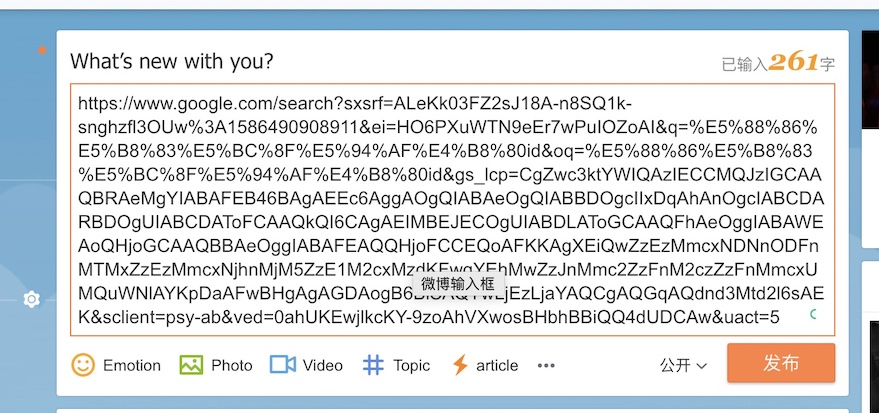
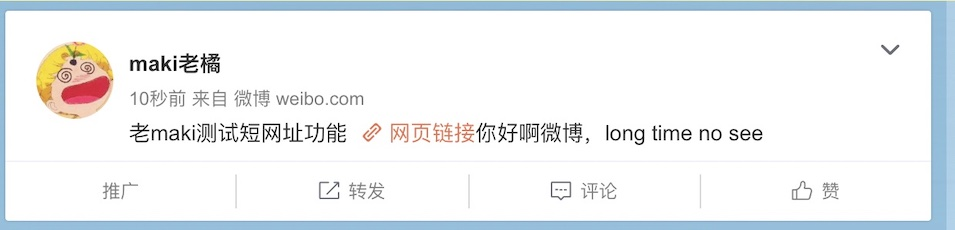
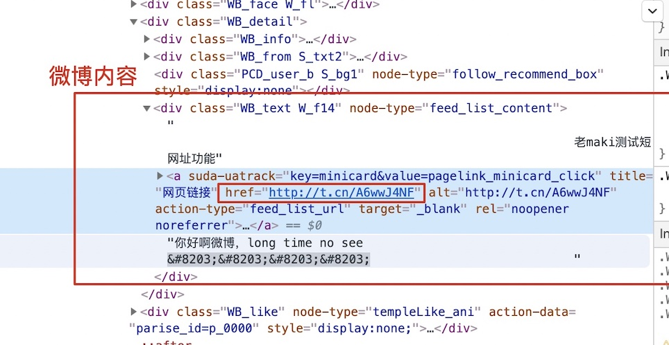

# cats' shaver 猫推子

## 初衷: go demo与面试题

有感于朱老师的面试题“设计一个短网址服务器”, 入职第一周要学习一门新语言golang来写一个demo项目。
索性就写一个短网址服务器好了。项目命名为shaver，剃须刀推子的意思，正好在给家里的两只猫剃毛所以取名为猫推子。

本项目想达到的目的：
- 自己和读者对于短网址服务器有一定的了解；
- 对项目mvp阶段有一定的认识；
- 对go的基本用法，如何构建服务端有一定的认识；

## 调研

## 使用原因

- short: 微博短信等展示方便，简化二维码，搜索引擎优化等；
- secure：防止特定信息的隐藏和修改；

## 短网址服务
- tinyurl: https://tinyurl.com/
- bitly: https://bitly.com/pages/why-bitly/bitly-101
- 新浪短网址服务: https://www.sina.lt/

## 使用场景体验

- 写微博：微博正文内有网址信息

- 发表：长网址变成四个字的href网页链接, 正常的微博内容被正确的保留了。

- 查看渲染后html信息

- 点击网络链接：直接rediect

## 项目设计(本期MVP版本)

### 对外核心功能

### 主链路

### 业务领域建模

### 物理系统设计

### 维护/可靠/扩展

## 关于go的开发
